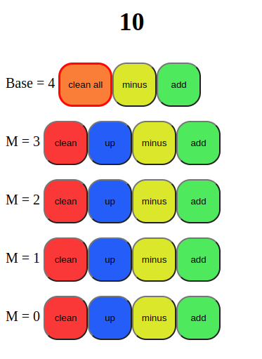

# counter
This is a counter web application.

It works offline, you just need to download all the files and run it in your browser: "index.html"

Tested on Linux and android.

## you can run it app:
[counter]((https://panacond.github.io/counter_vue/)https://panacond.github.io/counter_vue/)
